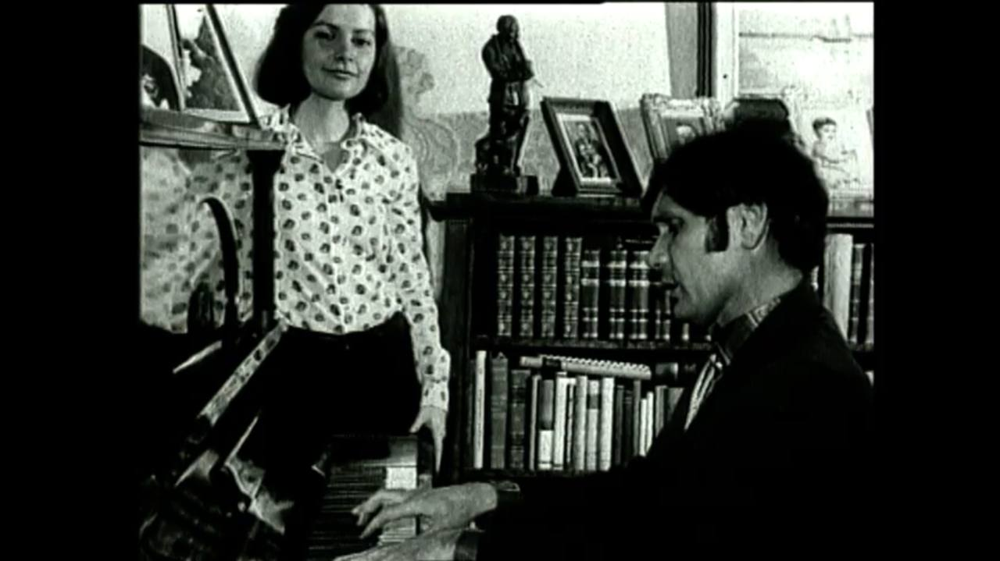

## Рождение
Ильгам Шакиров рождается в деревни Яңа Бүләк Ворошиловского района в 1935 году в семьи кузнеца Гыйльметдина.

## Горе в семье
В 1938 году отца забирают, он враг народа, пропагандист террористических идей.

---
<audio controls src="../../musics/025. Герман кое.mp3" title="Герман көе"></audio>

