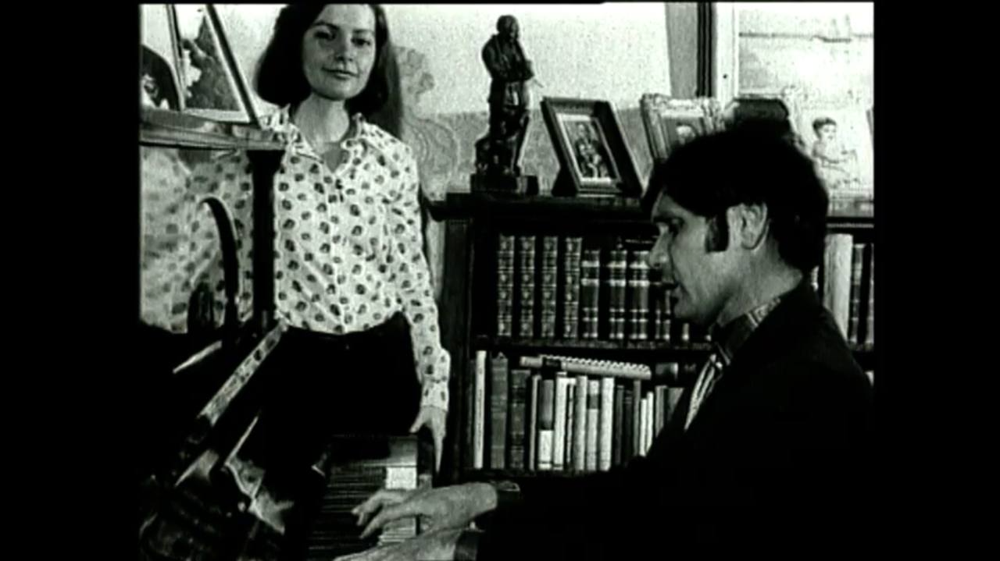

## Рождение
Ильгам Шакиров рождается в деревни Яңа Бүләк Ворошиловского района в 1935 году в семьи кузнеца Гыйльметдина.

## Горе в семье
В 1938 году отца забирают, он враг народа, пропагандист террористических идей.



<!-- [video](https://disk.yandex.ru/i/WL60E4mpmT1RZA)

<video controls width="600">
  <source src="(https://disk.yandex.ru/i/WL60E4mpmT1RZA.mp4" type="video/mp4">
  Ваш браузер не поддерживает видео.
</video> -->

